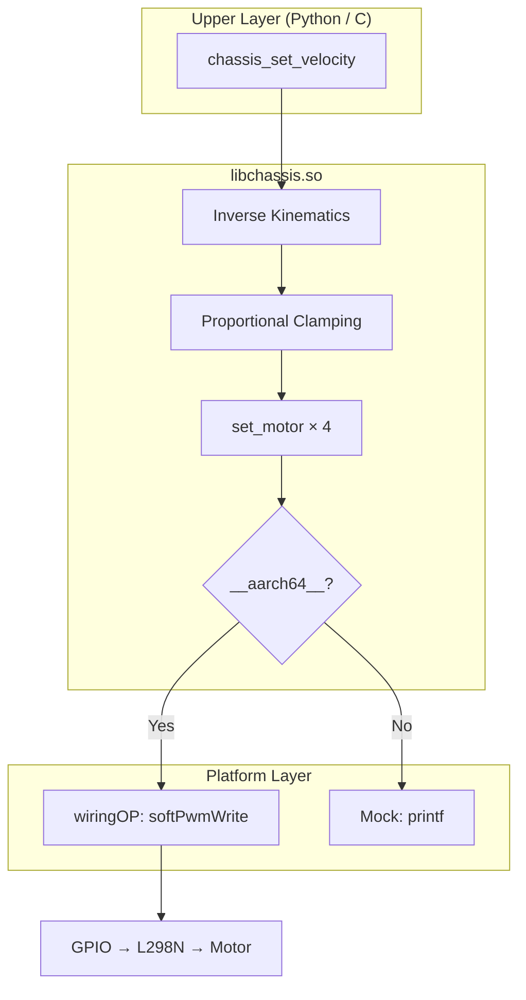

# libchassis 开发文档

## 项目结构

```
car-driver/
├── chassis.h          公共 API 头文件
├── chassis.c          核心实现
├── test_chassis.c     测试/验证程序
├── Makefile           构建系统
└── docs/
    ├── usage.md       使用文档
    └── development.md 开发文档（本文件）
```

## 架构设计



### 模块划分

| 模块 | 职责 |
|------|------|
| Mock 层 | 条件编译隔离 wiringOP 依赖，x86 下提供日志桩函数 |
| 日志系统 | 三级日志（DEBUG/INFO/ERROR），全英文输出 |
| 引脚管理 | 全局数组 `g_pins[8]`，init 时创建 8 个 softPWM 线程 |
| 电机驱动 | `set_motor()` 通过 `softPwmWrite` 统一控制 |
| 运动学解算 | 简化麦克纳姆轮逆运动学 + 比例限幅归一化 |

## 关键设计决策

### 1. softPwm 线程管理

**问题**：迷你 L298N 没有 EN 引脚，只能通过 IN1/IN2 控制。如果动态创建/销毁 softPwm 线程或混用 `digitalWrite`，会导致线程泄漏和电平冲突。

**方案**：
- `chassis_init()` 中对全部 8 个引脚一次性调用 `softPwmCreate(pin, 0, 100)`
- 运行时**仅使用 `softPwmWrite()`**，通过设置占空比为 0 实现"低电平"效果
- 杜绝 `digitalWrite()` 调用

### 2. 跨平台条件编译

**问题**：x86 开发机没有 wiringPi 头文件和库，`#include <wiringPi.h>` 会直接导致编译失败。

**方案**：将 `#include` 语句也包裹在 `#ifdef __aarch64__` 内：

```c
#ifdef __aarch64__
#include <wiringPi.h>
#include <softPwm.h>
#else
// mock function definitions
static int wiringPiSetup(void) { ... }
static void softPwmWrite(int pin, int value) { ... }
// ...
#endif
```

### 3. 逆运动学公式

标准麦克纳姆轮逆运动学（含轴距 L、轮距 W）：

```
FL = vy + vx + (L+W) × omega
FR = vy - vx - (L+W) × omega
RL = vy - vx + (L+W) × omega
RR = vy + vx - (L+W) × omega
```

由于未提供具体的 L 和 W 值，将 `(L+W)` 系数设为 1，简化为：

```
FL = vy + vx + omega
FR = vy - vx - omega
RL = vy - vx + omega
RR = vy + vx - omega
```

输入 `vx`, `vy`, `omega` 均归一化到 `[-1.0, 1.0]`。

### 4. 比例限幅归一化

解算后 4 个电机目标值可能超出 `[-1.0, 1.0]`（例如 `vx=1, vy=1, omega=1` 时 FL=3）。

**算法**：
1. 计算 4 个目标值的最大绝对值 `max_abs`
2. 若 `max_abs > 1.0`，所有值除以 `max_abs`
3. 将 `[-1.0, 1.0]` 映射到 `[-100, 100]` 的 PWM 范围

这保证了运动矢量方向不变，同时所有 PWM 值不超过硬件限制。

## 安全机制

| 场景 | 处理方式 |
|------|----------|
| `pins` 为 NULL | `chassis_init` 返回 -1，打印 ERROR |
| 未初始化调用运动函数 | 返回 -1，打印 ERROR |
| 重复初始化 | 返回 -1，提示先调用 cleanup |
| 程序退出/异常 | `chassis_cleanup` 将全部引脚 PWM 设为 0 |
